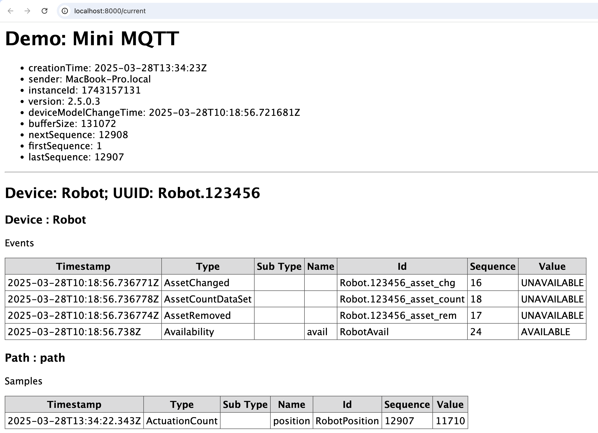
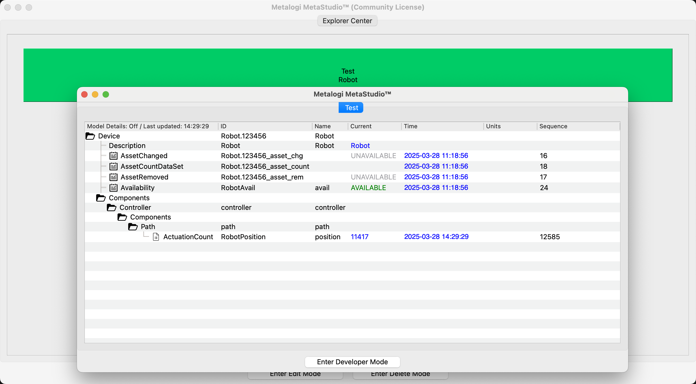
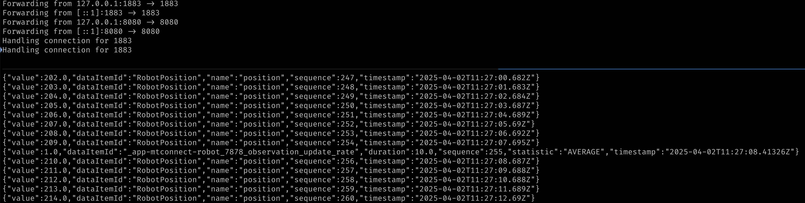

# Mini MQTT

This is a mini demo supporting MQTT. It connects to an MQTT broker at localhost:1883 if that broker is running.

## Demo

- Start the agent and the robot in 2 separate terminals.

```sh
# Start the agent for 1.3.
agent debug agent-1-3.cfg
# Start the agent for 2.0.
agent debug agent-2-0.cfg
# Start the robot.
deno run dev
```

- Visit [Streams](http://localhost:8000/current) in a web browser.
- You should see the `avail` is `AVAILABLE` and `position` is increasing.

```xml
<DeviceStream name="Robot" uuid="Robot.123456">
    <ComponentStream component="Device" name="Robot" componentId="Robot.123456">
        <Events>
            <AssetChanged assetType="UNAVAILABLE" dataItemId="Robot.123456_asset_chg" sequence="16" timestamp="2025-03-24T07:55:12.390022Z">UNAVAILABLE</AssetChanged>
            <AssetCountDataSet count="0" dataItemId="Robot.123456_asset_count" sequence="18" timestamp="2025-03-24T07:55:12.390032Z">UNAVAILABLE</AssetCountDataSet>
            <AssetRemoved assetType="UNAVAILABLE" dataItemId="Robot.123456_asset_rem" sequence="17" timestamp="2025-03-24T07:55:12.390027Z">UNAVAILABLE</AssetRemoved>
            <Availability dataItemId="RobotAvail" name="avail" sequence="24" timestamp="2025-03-24T07:55:12.391Z">AVAILABLE</Availability>
        </Events>
    </ComponentStream>
    <ComponentStream component="Path" name="path" componentId="path">
        <Samples>
            <ActuationCount dataItemId="RobotPosition" name="position" sequence="121" timestamp="2025-03-24T07:56:40.488Z">88</ActuationCount>
        </Samples>
    </ComponentStream>
</DeviceStream>
```



- Open the [Agent](http://localhost:8000/) page in MetaStudio and you should see the similar data.



## Kubenetes

This demo can be run in a Kubernetes cluster.

- Run the following commands to start the Kubernetes cluster.

```sh
kind delete cluster --name mtconnect
kind create cluster --config cluster.yaml
kubectl apply -f pods-services.yaml
```

- We shall see the following log.

```sh
Creating cluster "mtconnect" ...
 ✓ Ensuring node image (kindest/node:v1.32.2) 🖼
 ✓ Preparing nodes 📦 📦 📦 📦  
 ✓ Writing configuration 📜 
 ✓ Starting control-plane 🕹️ 
 ✓ Installing CNI 🔌 
 ✓ Installing StorageClass 💾 
 ✓ Joining worker nodes 🚜 
Set kubectl context to "kind-mtconnect"
You can now use your cluster with:

kubectl cluster-info --context kind-mtconnect

Have a nice day! 👋
pod/mtconnect-mqtt created
service/app-mtconnect-mqtt created
pod/mtconnect-agent created
service/app-mtconnect-agent created
pod/mtconnect-robot created
service/app-mtconnect-robot created
```

- Wait a few seconds and run the following command to set up the port-forward.

```sh
kubectl port-forward service/app-mtconnect-mqtt 1883:1883 8080:8080
```

- Subscribe the MQTT broker at `localhost:1883` and we shall see the MQTT messages.

```sh
mqtt sub -t '#'
```



## Links

- [Devices](http://localhost:8000/)
- [Streams](http://localhost:8000/current)
